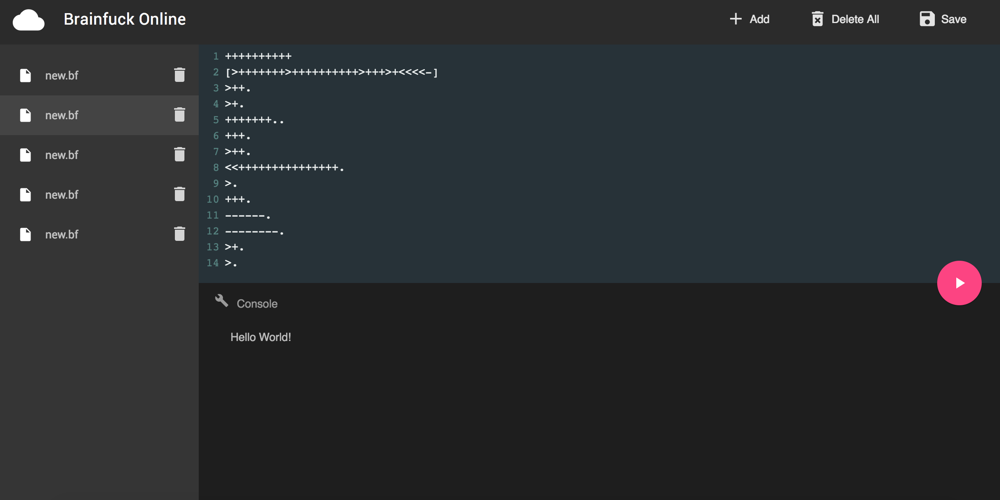

# 🐂 Brainfuck-IDE - 一个在线brainfuck语言解释器

这是一个基于React和Redux技术的brainfuck语言的在线解释器。

体验: [http://blog.yfgeek.com/BrainfuckIDE/](http://blog.yfgeek.com/BrainfuckIDE)

包含以下功能：

- [x] 添加，更改，删除单个程序
- [x] 解释程序
- [x] 高亮代码
- [x] 删除所有程序
- [x] 基于react-persist的数据持久化 (使用LocalStorage)
- [ ] 添加程序的"输入"
- [ ] 重命名程序名
- [ ] 添加程序的描述

更多功能还在开发中。

# 截图



# brainfuck语言

Müller的目标是创建一种简单的、可以用最小的编译器来实现的、匹配图灵完全思想的编程语言。这种语言由八种运算符构成，为Amiga机器编写的编译器（第二版）只有240个字节大小。

就像它的名字所暗示的，brainfuck程序很难读懂。尽管如此，brainfuck图灵机一样可以完成任何计算任务。虽然brainfuck的计算方式如此与众不同，但它确实能够正确运行。

这种语言基于一个简单的机器模型，除了指令，这个机器还包括：一个以字节为单位、被初始化为零的数组、一个指向该数组的指针（初始时指向数组的第一个字节）、以及用于输入输出的两个字节流。


## 命令

下面是这八种状态的描述，其中每个状态由一个字符标识：
| 字符   | 含义                                |
| ---- | --------------------------------- |
| `>`  | 指针加一                              |
| `<`  | 指针减一                              |
| `+`  | 指针指向的字节的值加一                       |
| `-`  | 指针指向的字节的值减一                       |
| `.`  | 输出指针指向的单元内容（ASCII码）               |
| `,`  | 输入内容到指针指向的单元（ASCII码）              |
| `[`  | 如果指针指向的单元值为零，向后跳转到对应的`]`指令的次一指令处  |
| `]`  | 如果指针指向的单元值不为零，向前跳转到对应的`[`指令的次一指令处 |

## 例子

### Hello World!

一个在屏幕上打印"Hello World!"的程序：

```brainfuck
++++++++               Set Cell #0 to 8
[
    >++++               Add 4 to Cell #1; this will always set Cell #1 to 4
    [                   as the cell will be cleared by the loop
        >++             Add 2 to Cell #2
        >+++            Add 3 to Cell #3
        >+++            Add 3 to Cell #4
        >+              Add 1 to Cell #5
        <<<<-           Decrement the loop counter in Cell #1
    ]                   Loop till Cell #1 is zero; number of iterations is 4
    >+                  Add 1 to Cell #2
    >+                  Add 1 to Cell #3
    >-                  Subtract 1 from Cell #4
    >>+                 Add 1 to Cell #6
    [<]                 Move back to the first zero cell you find; this will
                        be Cell #1 which was cleared by the previous loop
    <-                  Decrement the loop Counter in Cell #0
]                       Loop till Cell #0 is zero; number of iterations is 8

>>.                     Cell #2 has value 72 which is 'H'
>---.                   Subtract 3 from Cell #3 to get 101 which is 'e'
+++++++..+++.           Likewise for 'llo' from Cell #3
>>.                     Cell #5 is 32 for the space
<-.                     Subtract 1 from Cell #4 for 87 to give a 'W'
<.                      Cell #3 was set to 'o' from the end of 'Hello'
+++.------.--------.    Cell #3 for 'rl' and 'd'
>>+.                    Add 1 to Cell #5 gives us an exclamation point
>++.                    And finally a newline from Cell #6
```

Reference: [Wikipedia](https://en.wikipedia.org/wiki/Brainfuck)

